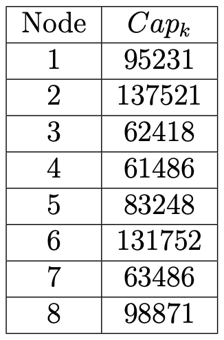
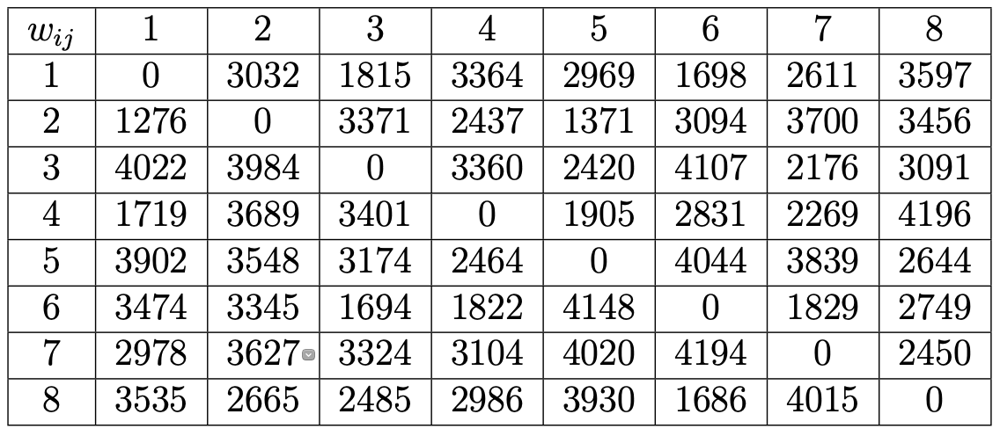
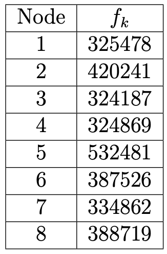
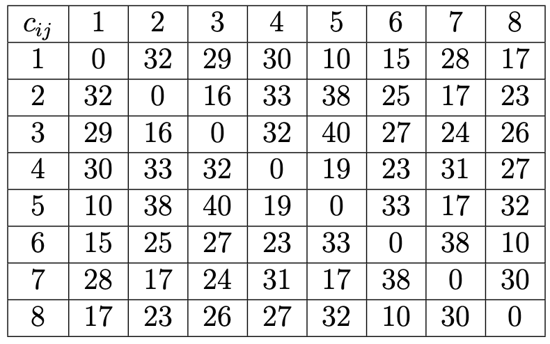
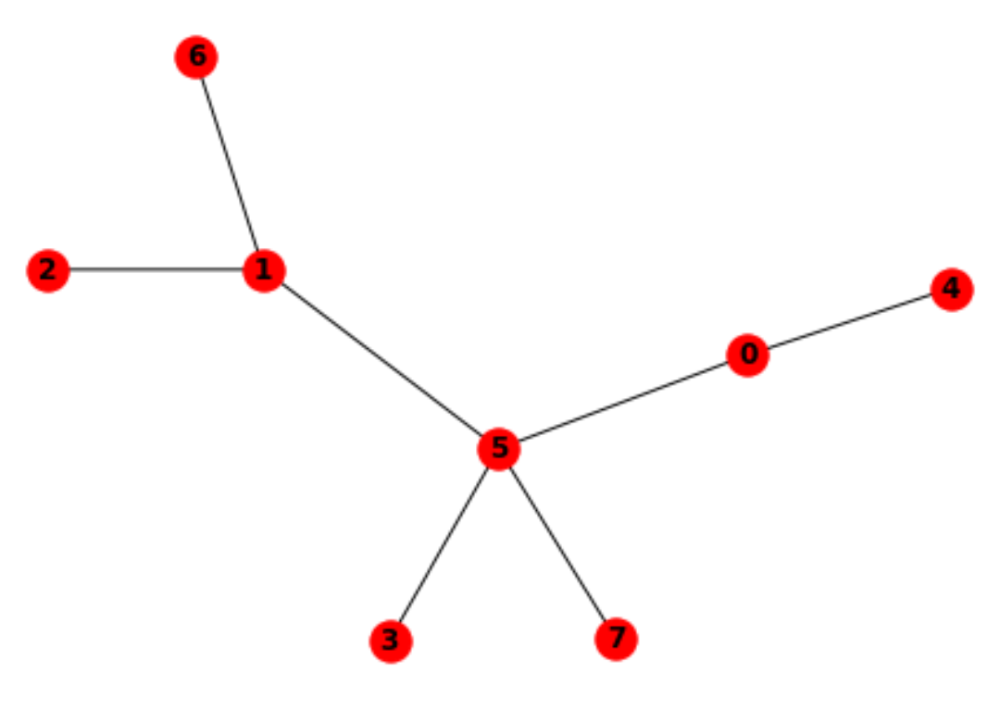

# Application of Genetic Algorithm on Hub Location Problem
*Academic project in Operational Research for Decision Aiding*

### Subject
[TPHubMILPforStudents.pdf](./TPHubMILPforStudents.pdf/)

### Data
* Nodes number = 8 ;
* Hub-to-Hub discount factor (*alpha*) ;\

* [Capacities](./capacity.csv/) ;\

* [Flows](./flow.csv/) ;\

* [Fixed Costs](./fixCost.csv/) ;\

* [Variable Costs](./varCost.csv/) ;\

### Result
The *optimal solution* is a network with **3 hubs** and 5 spokes :\
\
For more details, please read this [document](./Genetic_Algorithm_for_Hub_Location_Problem_1.pdf/).
